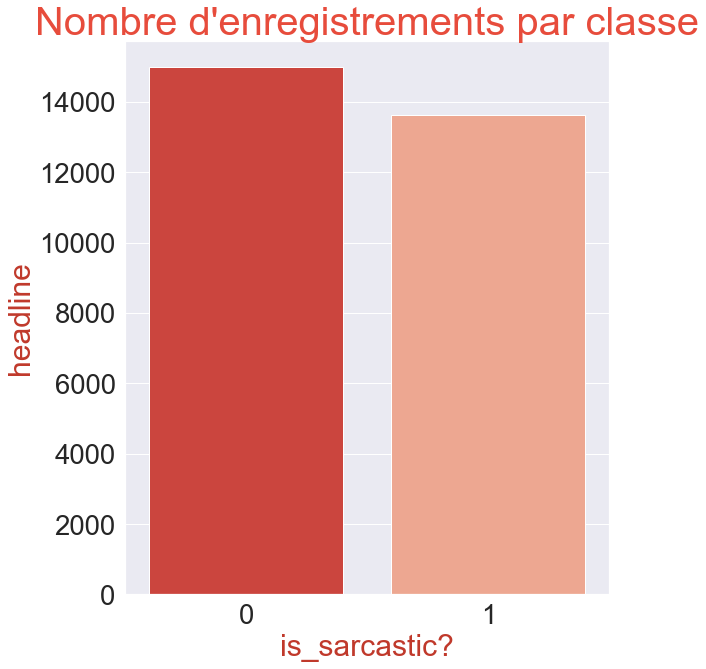
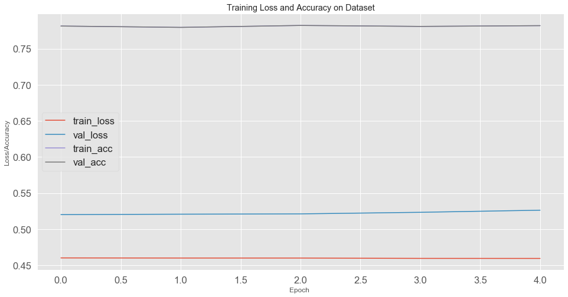

# <center/>SARCASM AND DEEP LEARNING </center>


```python
from jyquickhelper import add_notebook_menu
add_notebook_menu()
```


    ---------------------------------------------------------------------------

    ModuleNotFoundError                       Traceback (most recent call last)

    <ipython-input-1-1ed8d46a91d2> in <module>
    ----> 1 from jyquickhelper import add_notebook_menu
          2 add_notebook_menu()
    

    ModuleNotFoundError: No module named 'jyquickhelper'


# BACKGROUND

Data source : https://www.kaggle.com/rmisra/news-headlines-dataset-for-sarcasm-detection) 

Le dataframe comporte les colonnes suivantes:

1-headline: le titre de l'actualité  
2-is_sarcastic: 1 si l'enregistrement est sarcastique sinon 0  
3-article_link: lien vers l'article original. Utile pour collecter des données supplémentaires


 Librairies et dataframe


```python
#Importation des librairies
#! pip install stop_words
import seaborn as sns
import pandas as pd
import os
import numpy as np
import matplotlib.pyplot as plt
from sklearn.model_selection import train_test_split, GridSearchCV
from keras.preprocessing import text, sequence
from keras.layers.embeddings import Embedding
from keras.models import Sequential
from keras.layers import Dense, LSTM, Flatten
from keras.optimizers import Adam,SGD, RMSprop, Adagrad, Adadelta,Adamax, Nadam
from keras.utils import to_categorical
from keras.wrappers.scikit_learn import KerasClassifier
from keras.layers import Bidirectional, GlobalMaxPooling1D, Dropout
from keras.callbacks import EarlyStopping
from keras.utils import np_utils
import plotly.offline as py
import plotly.graph_objs  as go
from stopwords import get_stop_words
from nltk.corpus import stopwords
def make_callbacks():
    """Make list of callbacks for training - only Early Stopping here"""
    callbacks = [EarlyStopping(monitor='val_loss', patience=5)]
    return callbacks


callbacks = make_callbacks() 

#load dataset
data=pd.read_json('Sarcasm_Headlines_Dataset.json',lines=True)
```


    ---------------------------------------------------------------------------

    ModuleNotFoundError                       Traceback (most recent call last)

    <ipython-input-3-1023eb223964> in <module>
         19 import plotly.offline as py
         20 import plotly.graph_objs  as go
    ---> 21 from stopwords import get_stop_words
         22 from nltk.corpus import stopwords
         23 def make_callbacks():
    

    ModuleNotFoundError: No module named 'stopwords'


#  3-Exploration des données

## 3.1- Apercu des données


```python
#VISUALISATION DU DATAFRAME
data.to_excel('data_sarcasm.xlsx')
data.head(11)

```


<div>
<style scoped>
    .dataframe tbody tr th:only-of-type {
        vertical-align: middle;
    }

    .dataframe tbody tr th {
        vertical-align: top;
    }

    .dataframe thead th {
        text-align: right;
    }
</style>
<table border="1" class="dataframe">
  <thead>
    <tr style="text-align: right;">
      <th></th>
      <th>is_sarcastic</th>
      <th>headline</th>
      <th>article_link</th>
    </tr>
  </thead>
  <tbody>
    <tr>
      <th>0</th>
      <td>1</td>
      <td>thirtysomething scientists unveil doomsday clo...</td>
      <td>https://www.theonion.com/thirtysomething-scien...</td>
    </tr>
    <tr>
      <th>1</th>
      <td>0</td>
      <td>dem rep. totally nails why congress is falling...</td>
      <td>https://www.huffingtonpost.com/entry/donna-edw...</td>
    </tr>
    <tr>
      <th>2</th>
      <td>0</td>
      <td>eat your veggies: 9 deliciously different recipes</td>
      <td>https://www.huffingtonpost.com/entry/eat-your-...</td>
    </tr>
    <tr>
      <th>3</th>
      <td>1</td>
      <td>inclement weather prevents liar from getting t...</td>
      <td>https://local.theonion.com/inclement-weather-p...</td>
    </tr>
    <tr>
      <th>4</th>
      <td>1</td>
      <td>mother comes pretty close to using word 'strea...</td>
      <td>https://www.theonion.com/mother-comes-pretty-c...</td>
    </tr>
    <tr>
      <th>5</th>
      <td>0</td>
      <td>my white inheritance</td>
      <td>https://www.huffingtonpost.com/entry/my-white-...</td>
    </tr>
    <tr>
      <th>6</th>
      <td>0</td>
      <td>5 ways to file your taxes with less stress</td>
      <td>https://www.huffingtonpost.com/entry/5-ways-to...</td>
    </tr>
    <tr>
      <th>7</th>
      <td>1</td>
      <td>richard branson's global-warming donation near...</td>
      <td>https://www.theonion.com/richard-bransons-glob...</td>
    </tr>
    <tr>
      <th>8</th>
      <td>1</td>
      <td>shadow government getting too large to meet in...</td>
      <td>https://politics.theonion.com/shadow-governmen...</td>
    </tr>
    <tr>
      <th>9</th>
      <td>0</td>
      <td>lots of parents know this scenario</td>
      <td>https://www.huffingtonpost.comhttp://pubx.co/6...</td>
    </tr>
    <tr>
      <th>10</th>
      <td>0</td>
      <td>this lesbian is considered a father in indiana...</td>
      <td>https://www.huffingtonpost.com/entry/this-lesb...</td>
    </tr>
  </tbody>
</table>
</div>


```python
#DATA SIZE
data.shape
max_lenght=max([len(s)for s in data.headline])
max_lenght
```


    926


28619 enregistrements,OPO:construire un modèlè qui puisse prédire de la headline si une actualité est sarcastique ou pas.

## 3.2- Data visualisation


```python
#Visualisation du nombre de speechs par speaker
sns.set(font_scale=2.5)
df=data.groupby('is_sarcastic').count().reset_index()
plt.figure(figsize=(10,10))
sns.barplot(x=df['is_sarcastic'], y=df['headline'], palette="Reds_r")
plt.xlabel('is_sarcastic?', color='#c0392b')
plt.ylabel("headline", color='#c0392b')
plt.title("Nombre d'enregistrements par classe", fontsize=40, color='#e74c3c')
#plt.xticks(rotation= 45)
plt.tight_layout()
plt.savefig('figure2.png')

```


    

    


```python
sns.set(font_scale=2.5)
plt.figure(figsize=(20,18))
df.is_sarcastic.value_counts(normalize=True).plot(kind='pie', autopct='%1.1f%%',shadow=True,startangle=90)
plt.title('Répartition des classes')
#plt.axis('equal')
plt.savefig('camenbert1.png')
plt.show()
```


    

    


Il n' y a pas de disproportion significative dans la classification'

## 3.4 - Data préprocessing


```python
# data cleaning

#retrait stopwords
stop_words = list(get_stop_words('en'))         

#stop_words = set(stopwords.words('english'))
data['headline']=data['headline'].apply(lambda x: ' '.join([word for word in x.split() if word not in stop_words]))

```


```python
data
```


<div>
<style scoped>
    .dataframe tbody tr th:only-of-type {
        vertical-align: middle;
    }

    .dataframe tbody tr th {
        vertical-align: top;
    }

    .dataframe thead th {
        text-align: right;
    }
</style>
<table border="1" class="dataframe">
  <thead>
    <tr style="text-align: right;">
      <th></th>
      <th>is_sarcastic</th>
      <th>headline</th>
      <th>article_link</th>
    </tr>
  </thead>
  <tbody>
    <tr>
      <th>0</th>
      <td>1</td>
      <td>thirtysomething scientists unveil doomsday clo...</td>
      <td>https://www.theonion.com/thirtysomething-scien...</td>
    </tr>
    <tr>
      <th>1</th>
      <td>0</td>
      <td>dem rep. totally nails congress falling short ...</td>
      <td>https://www.huffingtonpost.com/entry/donna-edw...</td>
    </tr>
    <tr>
      <th>2</th>
      <td>0</td>
      <td>eat veggies: 9 deliciously different recipes</td>
      <td>https://www.huffingtonpost.com/entry/eat-your-...</td>
    </tr>
    <tr>
      <th>3</th>
      <td>1</td>
      <td>inclement weather prevents liar getting work</td>
      <td>https://local.theonion.com/inclement-weather-p...</td>
    </tr>
    <tr>
      <th>4</th>
      <td>1</td>
      <td>mother comes pretty close using word 'streamin...</td>
      <td>https://www.theonion.com/mother-comes-pretty-c...</td>
    </tr>
    <tr>
      <th>...</th>
      <td>...</td>
      <td>...</td>
      <td>...</td>
    </tr>
    <tr>
      <th>28614</th>
      <td>1</td>
      <td>jews celebrate rosh hashasha something</td>
      <td>https://www.theonion.com/jews-to-celebrate-ros...</td>
    </tr>
    <tr>
      <th>28615</th>
      <td>1</td>
      <td>internal affairs investigator disappointed con...</td>
      <td>https://local.theonion.com/internal-affairs-in...</td>
    </tr>
    <tr>
      <th>28616</th>
      <td>0</td>
      <td>beautiful acceptance speech week came queer ko...</td>
      <td>https://www.huffingtonpost.com/entry/andrew-ah...</td>
    </tr>
    <tr>
      <th>28617</th>
      <td>1</td>
      <td>mars probe destroyed orbiting spielberg-gates ...</td>
      <td>https://www.theonion.com/mars-probe-destroyed-...</td>
    </tr>
    <tr>
      <th>28618</th>
      <td>1</td>
      <td>dad clarifies food stop</td>
      <td>https://www.theonion.com/dad-clarifies-this-no...</td>
    </tr>
  </tbody>
</table>
<p>28619 rows × 3 columns</p>
</div>


```python
max_lenght=max([len(s) for s in data.headline])
max_lenght
```


    739


```python

# definitions des  features et du target
array=data.values
X=array[:,1]# features
y=array[:,0]# target
#split train data et test data
X_train,X_test,y_train,y_test=train_test_split(X, y, test_size=0.2, random_state=10)
# prepare le tokenizer
all_reviews=X
t=text.Tokenizer()
t.fit_on_texts(all_reviews)
# On récupère max_length comme étant la longueur de la plus longue headline
max_length = max([len(s.split()) for s in all_reviews])

# On transforme en séquence d'entiers 
x_train_seq=t.texts_to_sequences(X_train)
x_test_seq=t.texts_to_sequences(X_test)
# pad documents to a max length 

x_train_final=sequence.pad_sequences(x_train_seq,max_length,padding='post')
x_test_final=sequence.pad_sequences(x_test_seq, max_length,padding='post')

# definition la taille du vocabulaire, le 1 permet de régler la question de l'index qui démarre à un
vocab_size = len(t.word_index) + 1
print(x_train_final.shape)
y_test
```

    (22895, 107)
    


    array([1, 0, 1, ..., 1, 1, 1], dtype=object)


# Modélisation

Notre modèle  est une classification binaire des sentiments . Pour la modelisation , on va utiliser un RNN ,  qui convient parfaitement pour  ce type de probème.

Chargement du Glove Word Embedding


```python

embeddings_index = dict()
f = open(os.path.join('.', 'glove.6B.100d.txt'), encoding='utf-8')
for line in f:
    values = line.split()
    word = values[0]
    coefs = np.asarray(values[1:], dtype='float32')
    embeddings_index[word] = coefs
f.close()
print('Loaded %s word vectors.' % len(embeddings_index))

embedding_matrix = np.zeros((vocab_size, 100))
for word, i in t.word_index.items():
    embedding_vector = embeddings_index.get(word)
    if embedding_vector is not None:
        embedding_matrix[i] = embedding_vector
        
embedding_matrix.shape
```

    Loaded 400000 word vectors.
    


    (30803, 100)


## Construction du modèle


```python

e = Embedding(vocab_size, 100, weights=[embedding_matrix], input_length=max_length, trainable=False)
model = Sequential()
model.add(e)
#model.add(LSTM(32, recurrent_dropout=0.2))
model.add(Flatten())
model.add(Dense(1, activation='sigmoid'))
# compile the model
model.compile(loss='binary_crossentropy',
              optimizer=Adam(),
              metrics=['binary_accuracy'])
# summarize the model
model.summary()
```

    Model: "sequential_16"
    _________________________________________________________________
    Layer (type)                 Output Shape              Param #   
    =================================================================
    embedding_14 (Embedding)     (None, 107, 100)          3080300   
    _________________________________________________________________
    flatten_10 (Flatten)         (None, 10700)             0         
    _________________________________________________________________
    dense_16 (Dense)             (None, 1)                 10701     
    =================================================================
    Total params: 3,091,001
    Trainable params: 10,701
    Non-trainable params: 3,080,300
    _________________________________________________________________
    


```python
# model training
BATCH_SIZE=64
history_glove = model.fit(x_train_final, y_train,
                    batch_size=BATCH_SIZE,
                    epochs=5,
                    verbose=1, 
                    validation_split=0.2)

```

    Train on 18316 samples, validate on 4579 samples
    Epoch 1/5
    18316/18316 [==============================] - 1s 58us/step - loss: 0.4601 - binary_accuracy: 0.7814 - val_loss: 0.5201 - val_binary_accuracy: 0.7528
    Epoch 2/5
    18316/18316 [==============================] - 1s 58us/step - loss: 0.4599 - binary_accuracy: 0.7795 - val_loss: 0.5207 - val_binary_accuracy: 0.7547
    Epoch 3/5
    18316/18316 [==============================] - 1s 58us/step - loss: 0.4599 - binary_accuracy: 0.7822 - val_loss: 0.5211 - val_binary_accuracy: 0.7543
    Epoch 4/5
    18316/18316 [==============================] - 1s 56us/step - loss: 0.4594 - binary_accuracy: 0.7809 - val_loss: 0.5233 - val_binary_accuracy: 0.7530
    Epoch 5/5
    18316/18316 [==============================] - 1s 55us/step - loss: 0.4594 - binary_accuracy: 0.7819 - val_loss: 0.5262 - val_binary_accuracy: 0.7526
    


```python
#evaluation du modèle
score = model.evaluate(x_test_final, y_test, verbose=0)
print('Test loss:', score[0])
print('Test accuracy:', score[1])

# apprentissage
n = np.arange(0, 5)
sns.set(font_scale=1.5)
plt.style.use("ggplot")
plt.figure(figsize=(16,8))
plt.plot(n, history_glove.history["loss"], label="train_loss")
plt.plot(n, history_glove.history["val_loss"], label="val_loss")
plt.plot(n,history_glove.history["binary_accuracy"], label="train_acc")
plt.plot(n,history_glove.history["binary_accuracy"], label="val_acc")
plt.title("Training Loss and Accuracy on Dataset")
plt.xlabel("Epoch ")
plt.ylabel("Loss/Accuracy")
plt.legend(loc="center left")
plt.savefig('training.png')
plt.show()
```

    Test loss: 0.5344883307429313
    Test accuracy: 0.7466806173324585
    


    

    


## Amélioration du modèle


```python


model_pre_trained_2 = Sequential()
model_pre_trained_2.add(e)
model_pre_trained_2.add(Bidirectional(LSTM(64, recurrent_dropout=0.2, return_sequences=True)))
model_pre_trained_2.add(GlobalMaxPooling1D())
model_pre_trained_2.add(Dense(64, activation='relu'))
model_pre_trained_2.add(Dropout(0.2))
model_pre_trained_2.add(Dense(1, activation='sigmoid'))
# compile the model
model_pre_trained_2.compile(loss='binary_crossentropy',
              optimizer=Adam(),
              metrics=['binary_accuracy'])


# summarize the model
model_pre_trained_2.summary()


```

    Model: "sequential_17"
    _________________________________________________________________
    Layer (type)                 Output Shape              Param #   
    =================================================================
    embedding_14 (Embedding)     (None, 107, 100)          3080300   
    _________________________________________________________________
    bidirectional_3 (Bidirection (None, 107, 128)          84480     
    _________________________________________________________________
    global_max_pooling1d_3 (Glob (None, 128)               0         
    _________________________________________________________________
    dense_17 (Dense)             (None, 64)                8256      
    _________________________________________________________________
    dropout_3 (Dropout)          (None, 64)                0         
    _________________________________________________________________
    dense_18 (Dense)             (None, 1)                 65        
    =================================================================
    Total params: 3,173,101
    Trainable params: 92,801
    Non-trainable params: 3,080,300
    _________________________________________________________________
    


```python
history_pre_trained_2 = model_pre_trained_2.fit(x_train_final, y_train,
                    batch_size=BATCH_SIZE,
                    epochs=20,
                    verbose=1,
                    validation_split=0.2)
```

    Train on 18316 samples, validate on 4579 samples
    Epoch 1/20
    18316/18316 [==============================] - 59s 3ms/step - loss: 0.2536 - binary_accuracy: 0.8961 - val_loss: 0.4423 - val_binary_accuracy: 0.8080
    Epoch 2/20
    18316/18316 [==============================] - 58s 3ms/step - loss: 0.2101 - binary_accuracy: 0.9162 - val_loss: 0.4429 - val_binary_accuracy: 0.8142
    Epoch 3/20
    18316/18316 [==============================] - 57s 3ms/step - loss: 0.1702 - binary_accuracy: 0.9370 - val_loss: 0.5553 - val_binary_accuracy: 0.7877
    Epoch 4/20
    18316/18316 [==============================] - 57s 3ms/step - loss: 0.1394 - binary_accuracy: 0.9471 - val_loss: 0.4924 - val_binary_accuracy: 0.8187
    Epoch 5/20
    18316/18316 [==============================] - 57s 3ms/step - loss: 0.1151 - binary_accuracy: 0.9566 - val_loss: 0.5303 - val_binary_accuracy: 0.8152
    Epoch 6/20
    18316/18316 [==============================] - 56s 3ms/step - loss: 0.0937 - binary_accuracy: 0.9659 - val_loss: 0.6134 - val_binary_accuracy: 0.8069 bin
    Epoch 7/20
    18316/18316 [==============================] - 57s 3ms/step - loss: 0.0683 - binary_accuracy: 0.9755 - val_loss: 0.6148 - val_binary_accuracy: 0.8170
    Epoch 8/20
    18316/18316 [==============================] - 58s 3ms/step - loss: 0.0499 - binary_accuracy: 0.9845 - val_loss: 0.6784 - val_binary_accuracy: 0.8142
    Epoch 9/20
    18316/18316 [==============================] - 57s 3ms/step - loss: 0.0435 - binary_accuracy: 0.9853 - val_loss: 0.7181 - val_binary_accuracy: 0.8161
    Epoch 10/20
    18316/18316 [==============================] - 57s 3ms/step - loss: 0.0388 - binary_accuracy: 0.9866 - val_loss: 0.7813 - val_binary_accuracy: 0.8155
    Epoch 11/20
    18316/18316 [==============================] - 58s 3ms/step - loss: 0.0381 - binary_accuracy: 0.9876 - val_loss: 0.7850 - val_binary_accuracy: 0.8115
    Epoch 12/20
    18316/18316 [==============================] - 59s 3ms/step - loss: 0.0326 - binary_accuracy: 0.9892 - val_loss: 0.8548 - val_binary_accuracy: 0.8107
    Epoch 13/20
    18316/18316 [==============================] - 59s 3ms/step - loss: 0.0360 - binary_accuracy: 0.9872 - val_loss: 0.8435 - val_binary_accuracy: 0.8128
    Epoch 14/20
    18316/18316 [==============================] - 59s 3ms/step - loss: 0.0254 - binary_accuracy: 0.9921 - val_loss: 0.8977 - val_binary_accuracy: 0.81150.9 - ETA: 
    Epoch 15/20
    18316/18316 [==============================] - 58s 3ms/step - loss: 0.0326 - binary_accuracy: 0.9876 - val_loss: 0.9543 - val_binary_accuracy: 0.8035
    Epoch 16/20
    18316/18316 [==============================] - 58s 3ms/step - loss: 0.0259 - binary_accuracy: 0.9914 - val_loss: 0.9683 - val_binary_accuracy: 0.8010
    Epoch 17/20
    18316/18316 [==============================] - 58s 3ms/step - loss: 0.0220 - binary_accuracy: 0.9924 - val_loss: 0.9735 - val_binary_accuracy: 0.8065
    Epoch 18/20
    18316/18316 [==============================] - 58s 3ms/step - loss: 0.0170 - binary_accuracy: 0.9940 - val_loss: 1.0180 - val_binary_accuracy: 0.8117
    Epoch 19/20
    18316/18316 [==============================] - 58s 3ms/step - loss: 0.0164 - binary_accuracy: 0.9941 - val_loss: 1.0330 - val_binary_accuracy: 0.8098
    Epoch 20/20
    18316/18316 [==============================] - 57s 3ms/step - loss: 0.0253 - binary_accuracy: 0.9916 - val_loss: 0.9905 - val_binary_accuracy: 0.8152
    


```python
score_test = model_pre_trained_2.evaluate(x_test_final, y_test, verbose=0)
score_train=model_pre_trained_2.evaluate(x_train_final, y_train, verbose=0)
print ('Train loss:', score_train[0])
print('Train_accuracy:', score_test[1])
print('Test loss:', score_test[0])
print('Test accuracy:', score_test[1])
```

    Train loss: 0.2051905983339891
    Train_accuracy: 0.8100978136062622
    Test loss: 1.002865866795026
    Test accuracy: 0.8100978136062622
    

## Sauvegarde de notre modèle


```python
# On sérialise le modèle en JSON
model_serialised = model_pre_trained_2.to_json()
with open("model.json", "w") as json_file:
    json_file.write(model_serialised) # On sauve le modèle, plus exactement sa structure, la forme de son squelette
# On sauve les poids
model_pre_trained_2.save_weights("model.h5")
print("Saved model to disk")
 
```

    Saved model to disk
    

## Réutilisation de notre modèle


```python

from keras.models import model_from_json

# On créé le modèle à partir de la sauvegarde
json_file = open('model.json', 'r')
loaded_model_json = json_file.read()
json_file.close()
loaded_model = model_from_json(loaded_model_json)
# On charge les poids sauvegardés dans le modèle
loaded_model.load_weights("model.h5")
print("Loaded model from disk")
# On peut reprendre le cours de nos activités sans l'entrainement
loaded_model.compile(loss='binary_crossentropy', optimizer='adam', metrics=['accuracy'])
score = loaded_model.evaluate(x_test_final, y_test, verbose=0)
print("%s: %.2f" % (loaded_model.metrics_names[0], score[1]))
```

    Loaded model from disk
    loss: 0.81
    


```python
# make class predictions with the model
predictions =  loaded_model.predict_classes(x_test_final)
# summarize the first 5 cases
for i in range(5):
	print('%s => %d (expected %d)' % (X_test[i], predictions[i], y_test[i]))
```

    source jealousy even successful => 1 (expected 1)
    historical reenactor gets medieval drone buzzing overhead => 1 (expected 0)
    abused 12-year-old alabama girl think can handle mom top everything else => 1 (expected 1)
    allegiance white supremacy greater allegiance god? => 0 (expected 0)
    dude knit hat party calls beer 'libations' => 1 (expected 1)
    

Le modèle reussit à trouver  4 prédictions sur 5


